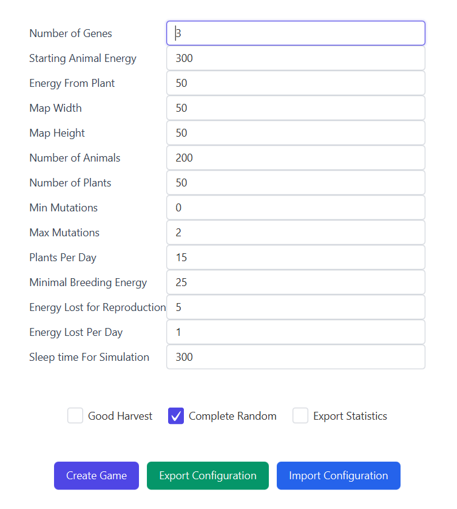
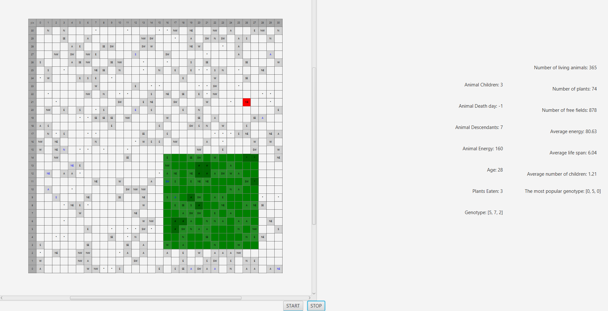
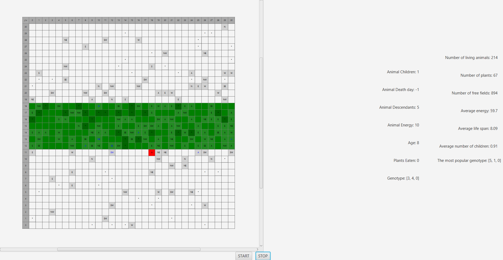

# Darwin World
Autorzy Karolina Nitsch, Michał Ryz

Projekt na Programowanie Obiektowe 2024/25 Darwin World.

Opis i wymagania projektu: https://github.com/Soamid/obiektowe-lab/tree/proj-2024/proj

## Uruchamianie
Należy uruchomić klasę główną src/main/java/.../World.java

## Konfiguracja
Aplikacja umożliwia:
- uruchamianie wielu symulacji równocześnie w osobnych oknach
- ręczne wprowadzanie konfiguracji lub wczytywanie z pliku
- zapisywanie konfiguracji

## Mutacje
Zwierzęta poruszają się na podstawie genotypów będących krzyżówką genotypów rodziców. Przy przekazywaniu genotypów mogą zachodzić mutacje.
- Complete Random - mutacja zmienia gen na dowolny inny gen
- Domyślnie - mutacja zmienia gen o 1 w górę lub w dół

## Opcje roślinności
- Dorodne plony (Good Harvest) - na preferowanym obszarze czasem pojawiają się większe rośliny, których zjedzenie dodaje zwierzakowi znacznie więcej energii. Każda taka roślina zajmuje kwadratowy obszar 2x2 pola.
  
- Równik (domyślnie) - preferowany przez rośliny jest poziomy pas pól w centralnej części mapy.
  

## Śledzenie i statystyki 
Aby śledzić konkretne zwierze:
- Zatrzymaj symulację przyciskiem STOP.
- Kliknij zwierzę na mapie – podświetli się na czerwono.
- W panelu bocznym pojawią się dodatkowe statystyki (data śmierci -1 oznacza, że zwierzę żyje).
## Legenda:

"*" trawa

"#" duża trawa 2x2

"A" wiele zwierząt na jednym polu

"N, NW, E..." – zwrot zwierzęcia (kierunek geograficzny)

Zielone pola - obszar dogodnych miejsc dla roślin

Niebieskie zwierzęta - zwierzęta z najpopularniejszym genotypem

Czerwone zwierze - śledzone zwierzę
